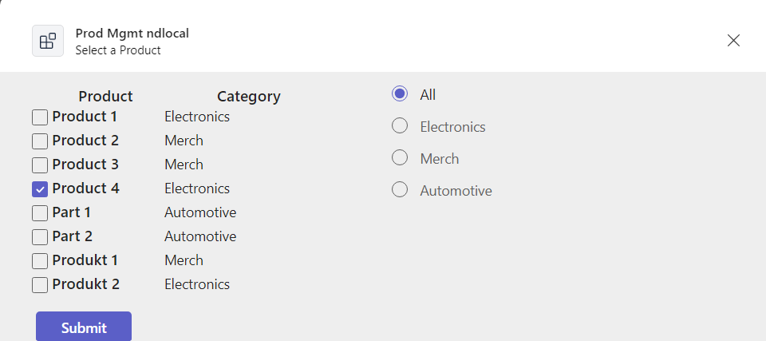
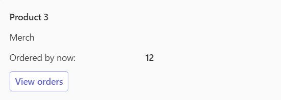

# msgext action search data - Microsoft 365 App
Teams/M365 messaging extension app handling (action-based) data retrieval and writing back

## Summary
This sample is a Teams and M365 Messaging Extension app created using the Teams Toolkit for Visual Studio Code. It is also intended to be used in Copilot. It retrieves a list of products to be further dealt with: Overview listed, order e.g. while all sent with Adaptive Cards in Teams or Outlook, resp Copilot ...started with the React with Fluent UI template.
It makes use of several Teams Dev capabilities (Tap with FluentUI, Azure Function, Messaging Extension)


App result:

|Task Module to select a product|
:-------------------------:


|Order Card result with weekday order option|
:-------------------------:


|Disday Order Card result|
:-------------------------:



## Tools and Frameworks


## Prerequisites

* [Office 365 tenant](https://dev.office.com/sharepoint/docs/spfx/set-up-your-development-environment)

## Applies to

This sample was created [using the Teams Toolkit with Visual Studio 2022](https://learn.microsoft.com/en-us/microsoftteams/platform/toolkit/teams-toolkit-fundamentals?WT.mc_id=M365-MVP-5004617). Nearly the same sample was also realized with the [using the Teams Toolkit with Visual Studio 2022](https://learn.microsoft.com/en-us/microsoftteams/platform/toolkit/toolkit-v4/teams-toolkit-fundamentals-vs?WT.mc_id=M365-MVP-5004617)


## Version history

Version|Date|Author|Comments
-------|----|--------|--------
1.0|May 31, 2024|[Markus Moeller](http://www.twitter.com/moeller2_0)|Initial release

## Disclaimer

**THIS CODE IS PROVIDED *AS IS* WITHOUT WARRANTY OF ANY KIND, EITHER EXPRESS OR IMPLIED, INCLUDING ANY IMPLIED WARRANTIES OF FITNESS FOR A PARTICULAR PURPOSE, MERCHANTABILITY, OR NON-INFRINGEMENT.**

---
## Minimal Path to Awesome
- Clone the repository
    ```bash
    git clone https://github.com/

1. First, select the Teams Toolkit icon on the left in the VS Code toolbar.
2. In the Account section, sign in with your [Microsoft 365 account](https://docs.microsoft.com/microsoftteams/platform/toolkit/accounts) if you haven't already.
3. Press F5 to start debugging which launches your app in Teams using a web browser. Select `Debug in Teams (Edge)` or `Debug in Teams (Chrome)`.
4. When Teams launches in the browser, select the Add button in the dialog to install your app to Teams.

**Congratulations**! You are running an application that can now show a beautiful web page in Teams, Outlook and the Microsoft 365 app.


